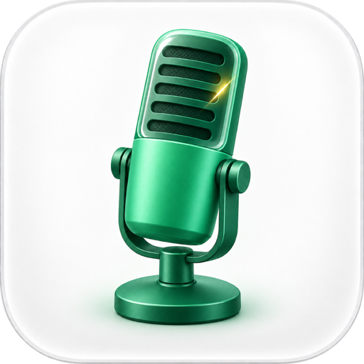

  

<h1 align="center">Talktu</h1>

  <strong>Hold a key. Say it. It's typed.</strong> 
  Fast, private dictation for your Mac that writes the way you meant to.

  <a href="../../releases/latest"><strong>Download the latest release →</strong></a>

---

Talktu lives in your menu bar and turns speech into clean, ready-to-send text in whatever app
you're using: Slack, Mail, your editor, a terminal, anywhere you can type. Hold the hotkey, talk,
let go. That's it.

## Features

### ⚡ Insistence on performance

Dictation is only useful if it's faster than typing, so Talktu treats every millisecond as a
bug. Speech and cleanup models load and warm up at launch, not on your first dictation. The
microphone keeps a short pre-roll, so your first word never gets clipped. Screen context is
captured *while* you're still talking, so it's ready the moment you stop. It all runs natively
on Apple Silicon, with no round trip to a server to wait on.

### 🔒 Private by design

Everything happens on your Mac. Speech recognition, cleanup, and screen reading all run
on-device. After the one-time model download, Talktu makes no network calls except an update
check that you start yourself. No accounts, no cloud, no audio ever saved.

### ✨ Text you'd actually send

Raw transcripts are messy. A local language model tidies yours up before it's pasted: filler
words gone, punctuation and capitalization fixed, and rambling run-on sentences reshaped into
something you'd actually write.

### 👀 Knows what's on your screen

Talktu can read the names and terms in your current window as you speak, so colleagues' names,
project jargon, `camelCase` identifiers, `@handles`, and `#channels` come out spelled right, even
when you say them quickly.

### 📝 Your vocabulary, spelled right

Add your own list of names and terms in Settings and Talktu will get them right every time. No
screen access needed.

### 🎛️ Tuned to your Mac

Pick the speech engine and model sizes that suit you: go small and snappy, or large and more
accurate. Multilingual recognition is available too. On macOS 26, Apple's built-in on-device
models are an option with nothing extra to download.

### 🤫 Stays out of your way

- **Hold to talk** (Right Option by default), or **tap to toggle** for longer thoughts.
- Press **Escape** to throw a dictation away.
- Your clipboard is put back exactly as it was after each paste.
- A small floating overlay shows what's happening, then gets out of sight.
- Recent dictations are kept in **history** (text only), so you can reuse something you said
  earlier.
- Pin your favorite microphone. If it's unplugged, Talktu falls back to the system default for
  that one dictation and goes back to yours next time.

## Install

1. Download the `.dmg` from the [latest release](../../releases/latest).
2. Open it and drag **Talktu** into **Applications**.
3. Launch it and grant the permissions it asks for: Microphone, Accessibility, and Input
   Monitoring. Screen Recording is optional and only powers screen-aware spelling.

Every build is signed with a Developer ID certificate and notarized by Apple, so it opens without
any Gatekeeper workarounds.

## Requirements

- macOS 14 Sonoma or later
- A Mac with Apple Silicon
